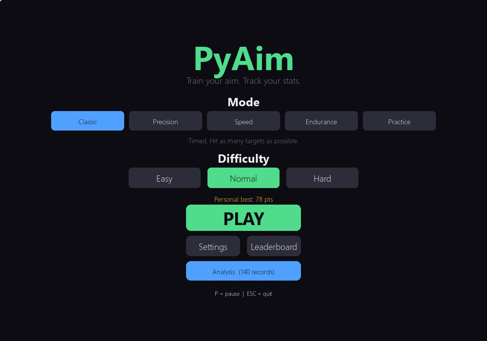
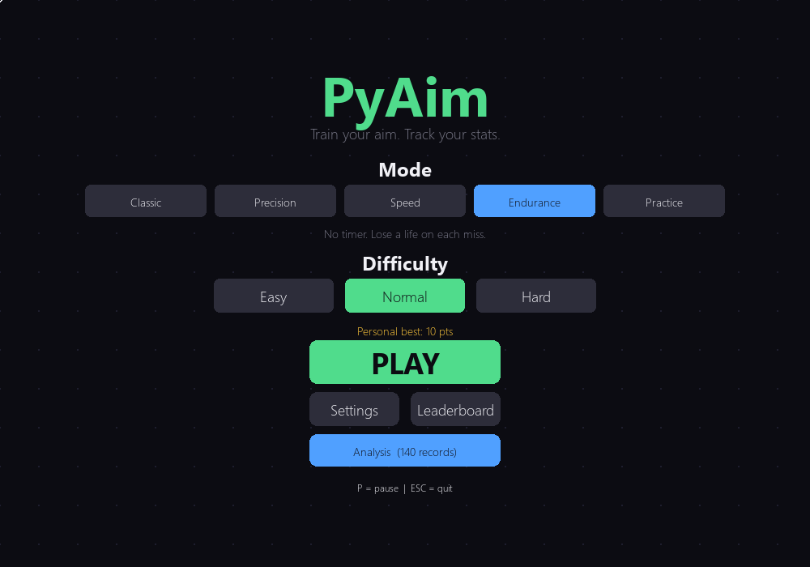
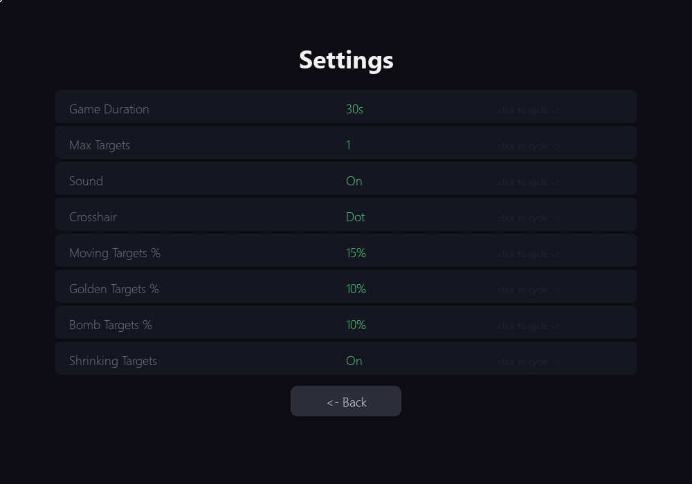
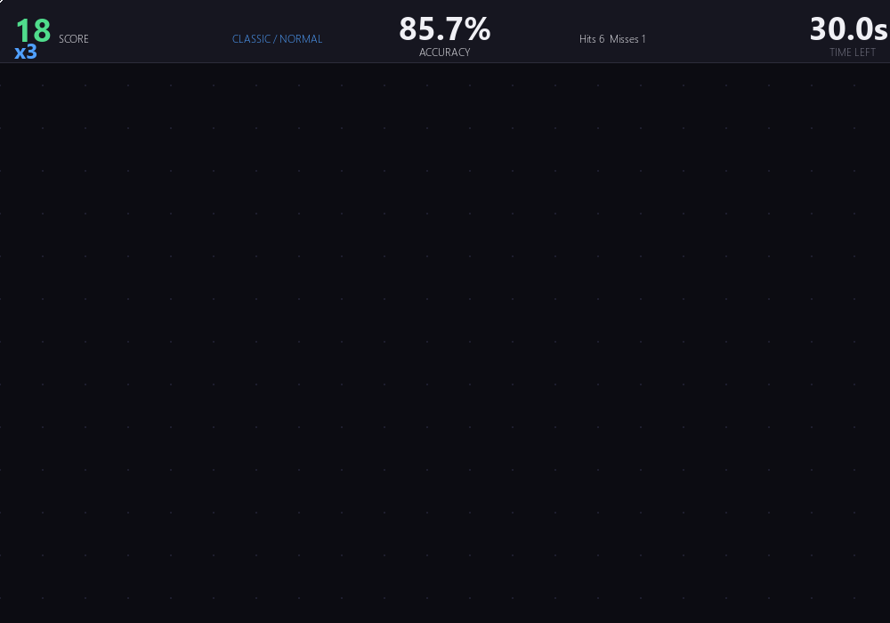
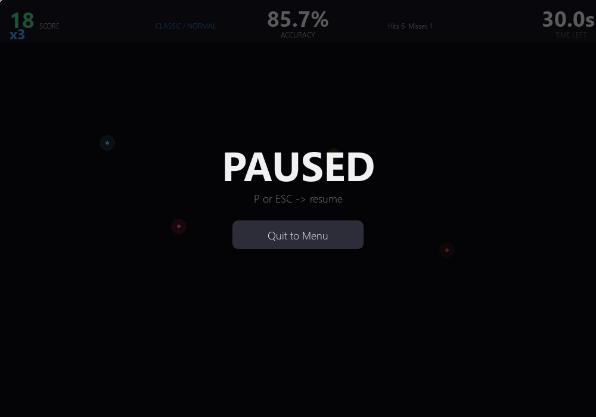
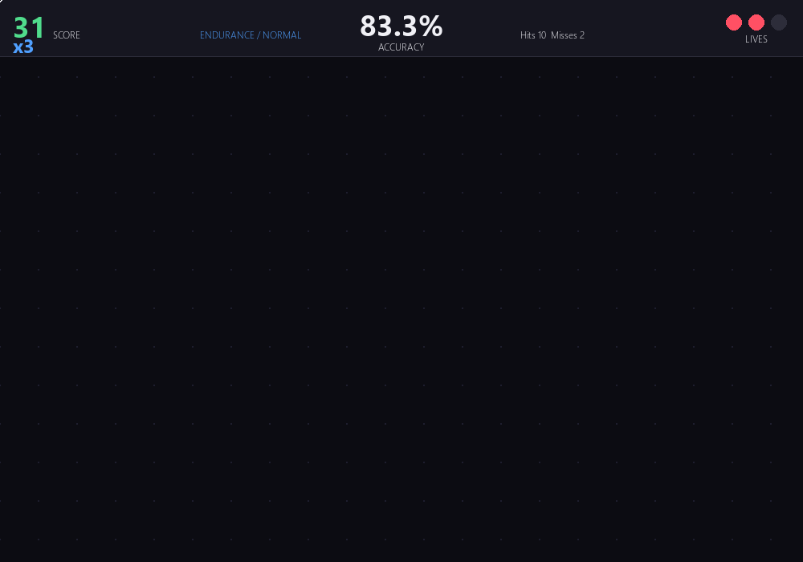
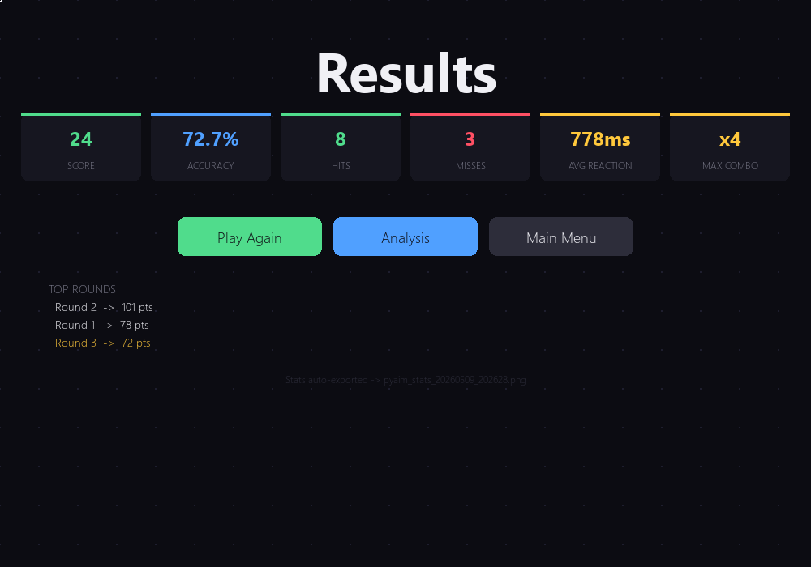
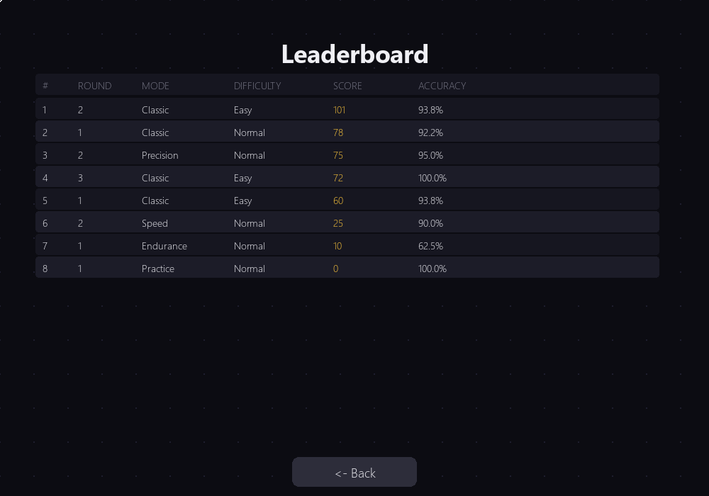
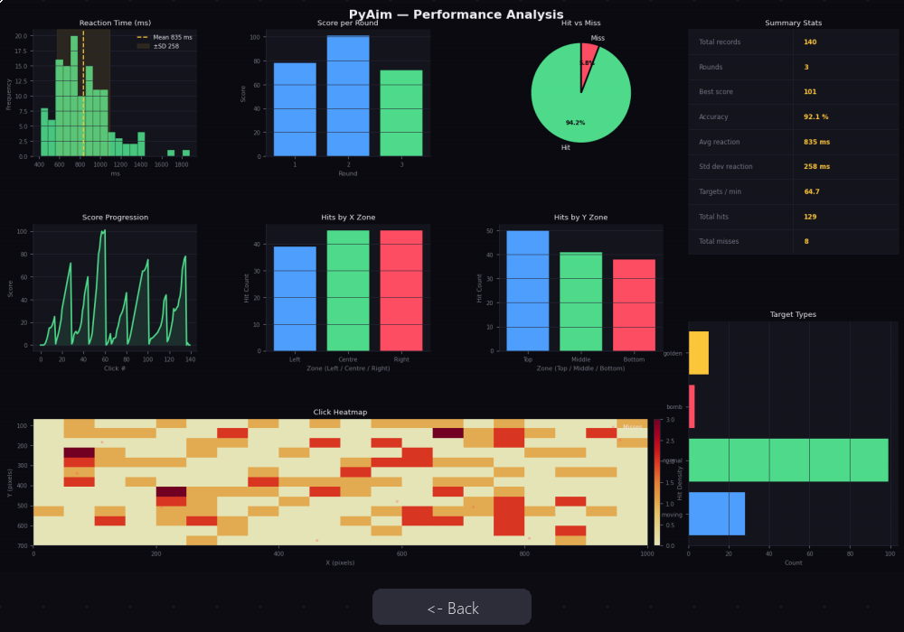

# Project Description

## 1. Project Overview

- **Project Name:** PyAim

- **Brief Description:**
  PyAim is a 2D aim-training game built with Python and Pygame. Players click on targets that appear randomly on screen before they disappear, competing against time and their own previous performance. The game records every click interaction into a CSV file and provides a built-in statistical analysis screen with seven graphs covering reaction time, accuracy, score progression, and spatial click distribution.

  The project is structured using Object-Oriented Programming principles with a full class hierarchy, multiple game modes, target types with different behaviours, a combo multiplier system, procedural sound effects, particle effects, and a persistent leaderboard. All data collection and visualisation runs inside the game window with no separate scripts required.

- **Problem Statement:**
  Most aim-trainer games offer gameplay but no meaningful feedback on performance over time. Players have no way to track whether their reaction speed is improving, which screen zones they struggle with, or how consistent their accuracy is across sessions. PyAim solves this by recording every click event and presenting the analysis directly inside the game.

- **Target Users:**
  - Students and casual gamers wanting to improve mouse accuracy and reaction speed
  - FPS players looking for a lightweight warm-up tool
  - Programming students interested in a practical example of OOP, data collection, and visualisation

- **Key Features:**
  - 5 game modes: Classic, Precision, Speed, Endurance, Practice
  - 4 target types: Normal, Moving, Golden (3× points), Bomb (penalty)
  - Combo multiplier system up to ×5
  - Per-session CSV data recording in append mode
  - Built-in analysis screen with 7 matplotlib graphs
  - Reaction time histogram with mean and standard deviation
  - Click heatmap showing spatial accuracy across the play area
  - Score progression line graph and per-round bar chart
  - X-zone and Y-zone bar charts for spatial analysis
  - Personal best tracking per mode and difficulty
  - Settings screen (duration, target mix, crosshair style, sound)
  - Leaderboard screen showing top 10 rounds from CSV history
  - Auto-export of stats PNG after each session
  - Particle burst and screen shake visual feedback
  - Procedural sound effects with graceful fallback if numpy unavailable

- **Screenshots:**

  | Screen | Preview |
  |---|---|
  | Main Menu |  |
  | Menu — Endurance Mode |  |
  | Settings Screen |  |
  | Gameplay |  | 
  | Pause Menu |  |
  | Gameplay — Endurance (2 lives) |  |
  | Results Screen |  |
  | Leaderboard |  |
  | Analysis — All 7 graphs |  |

- **Proposal:**
  [View Proposal PDF](Proposal.pdf)

- **YouTube Presentation:**
  [Watch Presentation](https://www.youtube.com/watch?v=O5KODP9gD90)
  
  The presentation covers:
  1. A short intro and full demonstration of the game and statistics screen
  2. An explanation of the class design and how each class is used
  3. An explanation of the statistics, data features, and visualisation choices

---

## 2. Concept

### 2.1 Background

- **Why this project exists:**
  Aim training is a well-established practice in the FPS gaming community, but existing tools are either too complex, require installation of large applications, or provide no statistical feedback. A lightweight Python implementation gives students and casual players a simple tool they can run, modify, and learn from.

- **What inspired it:**
  The project is inspired by browser-based aim trainers and professional tools like Aim Lab. The key gap that inspired PyAim is the lack of data feedback in simple trainers — most only show a final score with no breakdown of where performance is weak.

- **Importance of solving this problem:**
  Reaction speed and mouse accuracy are measurable skills. Without data, players cannot identify whether they are improving or which areas of the screen cause the most misses. PyAim turns every game session into a data collection opportunity, making skill development visible and measurable.

### 2.2 Objectives

- Record every click and target event as a structured row in a CSV file using append mode, so data accumulates across sessions and easily exceeds the 100-record threshold
- Calculate and display accuracy, average reaction time, standard deviation, and targets per minute after each session
- Visualise performance with at least five graph types as required by the proposal, plus bonus graphs (heatmap, target type breakdown)
- Implement a clean OOP structure with a base class and at least one inheritance chain, separating concerns across dedicated classes
- Support multiple difficulty levels and game modes so the game remains challenging and replayable
- Keep all analysis inside the game window so no separate script is needed

---

## 3. UML Class Diagram

The UML class diagram shows all classes, their attributes, methods, and relationships including the `GameObject → Target` inheritance chain and associations between `Game` and all sub-systems.

**Attachment:** [PyAim_UML.pdf](PyAim_UML.pdf)

Key relationships shown in the diagram:
- `Target` inherits from `GameObject`
- `MovingTarget`, `GoldenTarget`, and `BombTarget` each inherit from `Target`
- `Game` owns (composition) instances of `Player`, `Timer`, `ScoreManager`, `DataCollector`, `Settings`, `SoundSystem`, `ParticleSystem`, and `StatsRenderer`
- `Game` creates and manages a list of `Target` objects during gameplay

---

## 4. Object-Oriented Programming Implementation

- **`GameObject`** — Base class defining shared position attributes `x` and `y` and a `draw()` interface. All on-screen objects inherit from this class.

- **`Target(GameObject)`** — Represents a standard clickable target. Inherits position from `GameObject` and adds `radius`, `spawn_time`, `lifetime_ms`, shrinking behaviour, flicker behaviour, and collision detection via `is_clicked()`. Contains the countdown arc drawing and grow-in animation.

- **`MovingTarget(Target)`** — Extends `Target` with a velocity vector (`vx`, `vy`) that causes the target to bounce around the play area. Worth 2× points.

- **`GoldenTarget(Target)`** — Extends `Target` with a gold colour and reduced radius. Worth 3× points and plays a different sound on hit.

- **`BombTarget(Target)`** — Extends `Target` with a dark red colour and a negative point value. Clicking it deducts points, triggers screen shake, and costs a life in Endurance mode. Shrinking and flicker are disabled.

- **`Player`** — Tracks `total_clicks`, `hits`, and `misses`. Provides `register_hit()`, `register_miss()`, and `get_accuracy()` using the formula `(hits / total_clicks) × 100`.

- **`Timer`** — Manages the game countdown using `start_time` and `duration`. Provides `get_time_left()` and `is_time_up()`.

- **`ScoreManager`** — Handles the score and combo multiplier. `add_score()` multiplies points by the current combo (capped at ×5) and returns the gained amount for display. `break_combo()` resets the multiplier on a miss.

- **`DataCollector`** — Records one CSV row per click or target expiry event using `record_click()`. Saves to file in append mode via `save_to_csv()` and reads history with `load_data()`. Fields match the proposal: `round`, `target_x`, `target_y`, `target_size`, `spawn_time`, `click_time`, `reaction_time`, `result`, `score`, `difficulty`, plus extras `session_id`, `mode`, `combo`, `target_type`.

- **`Settings`** — Loads and saves game settings to a JSON file. Uses `cycle()` to step through option lists when the player clicks a setting row. Provides attribute-style access via `__getattr__` and `__setattr__`.

- **`SoundSystem`** — Generates procedural beep sounds using numpy and pygame.sndarray. Provides named sounds: `hit`, `miss`, `combo`, `golden`, `bomb`, `start`, `end`, `life`. Fails silently if numpy is unavailable.

- **`Particle` / `ParticleSystem`** — `Particle` is a single short-lived dot with position, velocity, colour, and lifetime. `ParticleSystem` manages a list of particles, updating and drawing them each frame, and providing `burst()` to spawn a group at a given position.

- **`StatsRenderer`** — Builds all seven matplotlib graphs in memory and returns a `pygame.Surface` using an `io.BytesIO` buffer — no file write required for display. Optionally exports a PNG when `export_path` is provided. Handles: reaction histogram, score bar chart, hit/miss pie, score progression line, X-zone bar, Y-zone bar, click heatmap, summary stats table, and target type breakdown.

- **`Game`** — The main controller. Manages the state machine (`MENU`, `SETTINGS`, `PLAYING`, `PAUSED`, `RESULTS`, `STATS`, `LEADERBOARD`), owns all sub-system instances, handles the event loop via `handle_events()`, advances game logic in `update()`, and renders all screens in `draw()`. Implements `start_game()` and `end_game()` as defined in the proposal.

---

## 5. Statistical Data

### 5.1 Data Recording Method

Data is stored in `pyaim_data.csv` using Python's built-in `csv` module. The file is opened in **append mode** each time `save_to_csv()` is called, ensuring that records from multiple gameplay sessions accumulate rather than being overwritten. The header row is written only once when the file does not yet exist.

Every click on a target and every target expiry (miss) generates exactly one row. A typical 30-second session produces 30–60 rows. After a few sessions the dataset easily exceeds the 100-record minimum required by the proposal.

After every session the `StatsRenderer` also auto-exports a timestamped PNG file (`pyaim_stats_YYYYMMDD_HHMMSS.png`) containing all seven graphs for that session.

### 5.2 Data Features

| Feature | Description | Source | Graph |
|---|---|---|---|
| `reaction_time` (ms) | Time from target spawn to player click. Stored in milliseconds. `None` for misses. | `click_time - spawn_time` | Graph 1 — Histogram |
| `score` | Running score at the time of the click event. | `ScoreManager` | Graph 2 — Bar, Graph 4 — Line |
| `result` | Outcome of the event: `hit`, `miss`, or `bomb`. | `Player` registers | Graph 3 — Pie |
| `target_x`, `target_y` | Spawn coordinates of the target in pixels. | `Target` position | Graph 5a/5b — Zone bars, Graph 6 — Heatmap |
| `target_size` | Base radius of the target in pixels. Varies by difficulty. | `Target._base_rad` | Summary panel |
| `round` | Incremented each time a new game starts. Groups rows into sessions. | `Game.round_n` | Graph 2 — X axis |
| `difficulty` | Easy / Normal / Hard setting active when the event occurred. | `Game.difficulty` | Leaderboard, summary |
| `mode` | Game mode active during the session. | `Game.mode` | Leaderboard |
| `combo` | Combo multiplier value at the time of the hit. | `ScoreManager.combo` | Summary |
| `target_type` | Type of target: normal / moving / golden / bomb. | `Target.TYPE` | Target type bar chart |
| `session_id` | Timestamp string identifying the launch session. | `datetime.now()` | Leaderboard grouping |

**Derived statistics calculated from raw data at analysis time:**

| Statistic | Formula |
|---|---|
| Accuracy | `(hits / total_clicks) × 100` |
| Average reaction time | `mean(reaction_time)` for hits only |
| Standard deviation | `stdev(reaction_time)` for hits only |
| Targets per minute | `total_hits / (time_span_seconds / 60)` |

---

## 6. Changed Proposed Features

| Change | Reason |
|---|---|
| Added 4 game modes (Precision, Speed, Endurance, Practice) beyond the original Classic mode | Increases replayability and allows players to train different skills |
| Added 3 extra target types: MovingTarget, GoldenTarget, BombTarget | Makes gameplay more varied and tests different aiming skills; inspired by teacher feedback suggesting buff/debuff events |
| Graph 6 is a 2D heatmap instead of a scatter plot | Teacher feedback (01/04) explicitly requested a different visualisation for target position beyond a plain scatter |
| Added `session_id`, `mode`, `combo`, `target_type` columns to CSV beyond the required fields | Extra columns are needed to support the leaderboard, mode filtering, and target type breakdown graph |
| Analysis screen is built into the game window instead of a separate script | More convenient — no need to run a second file; all functionality accessible from the menu |
| Added combo multiplier, screen shake, particles, and procedural sounds | Improves game feel and gives players immediate feedback without changing the core OOP or data structure |
| Project split into 12 separate files (one class per file) | Improves readability and maintainability; each file has a single responsibility |

---

## 7. External Sources

| Item | Author / Source | License |
|---|---|---|
| Pygame | [pygame.org](https://www.pygame.org) | LGPL |
| Matplotlib | [matplotlib.org](https://matplotlib.org) | PSF-based (BSD compatible) |
| NumPy | [numpy.org](https://numpy.org) | BSD 3-Clause |
| Python standard library (`csv`, `json`, `math`, `random`, `statistics`, `io`) | Python Software Foundation | PSF License |

No external images, music files, or third-party source code were used. All game graphics are drawn programmatically with pygame drawing functions. All sounds are generated procedurally using NumPy sine waves.
