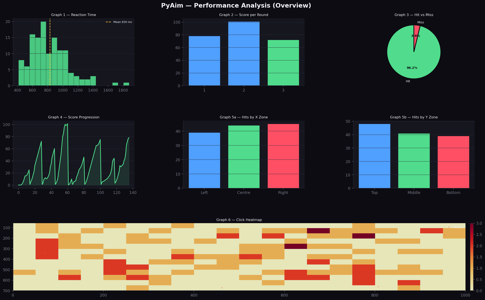
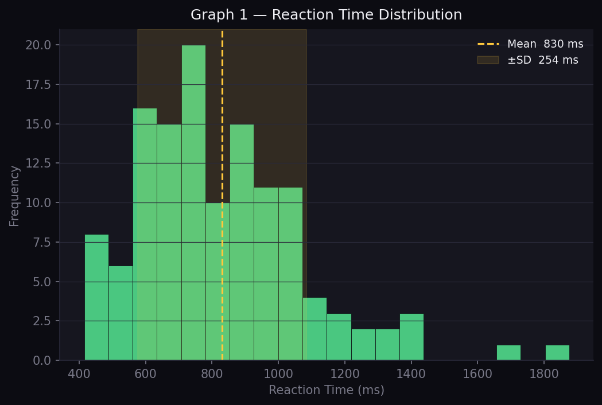
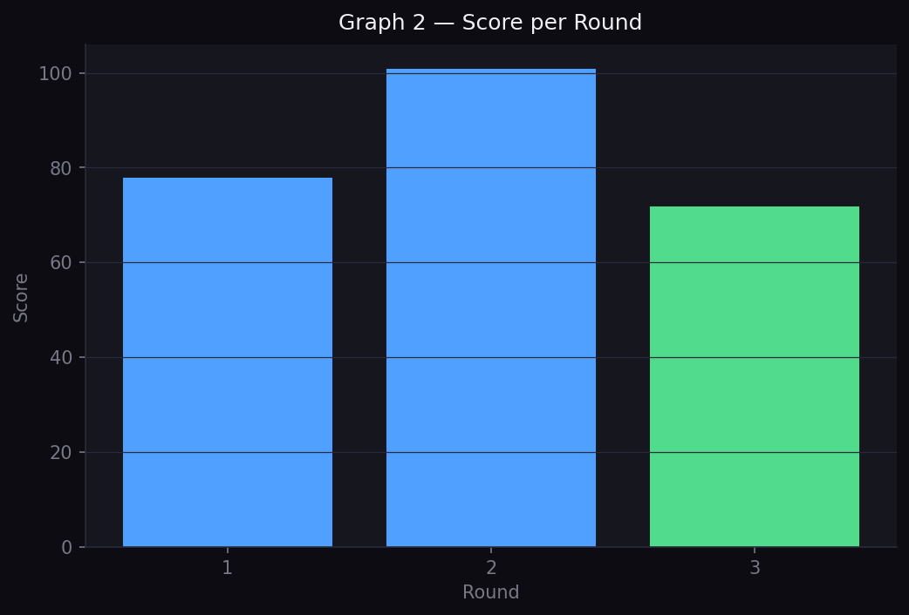
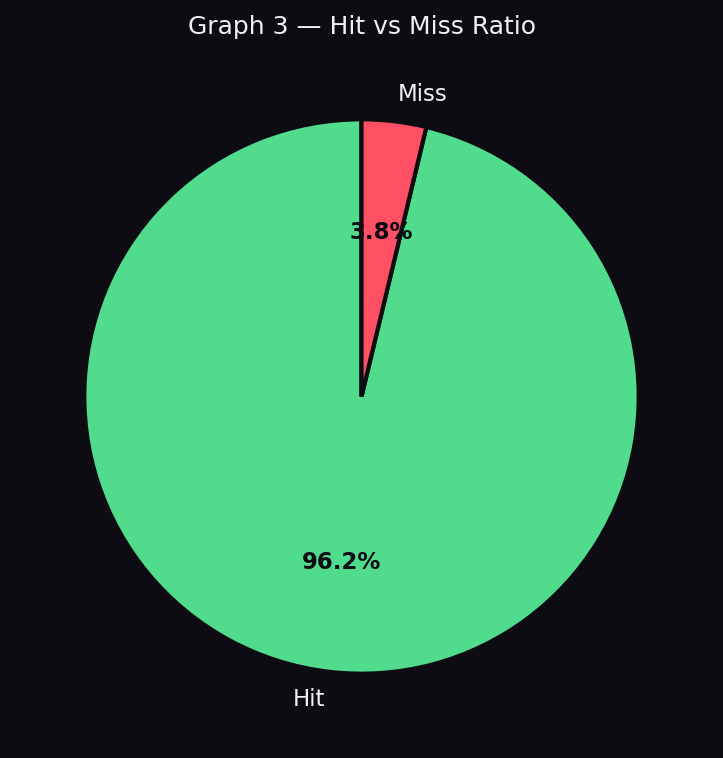
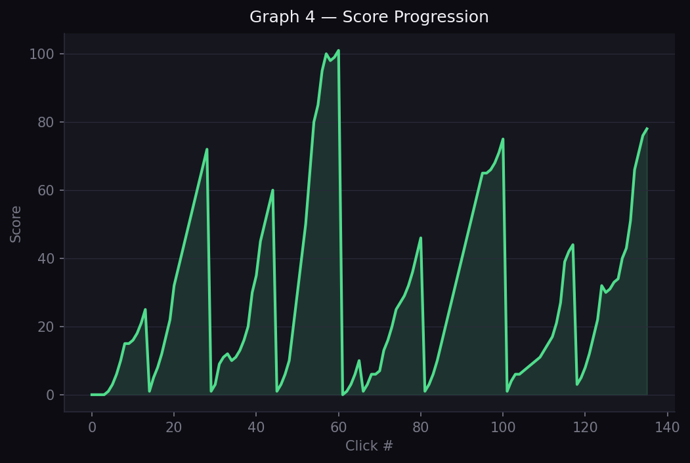
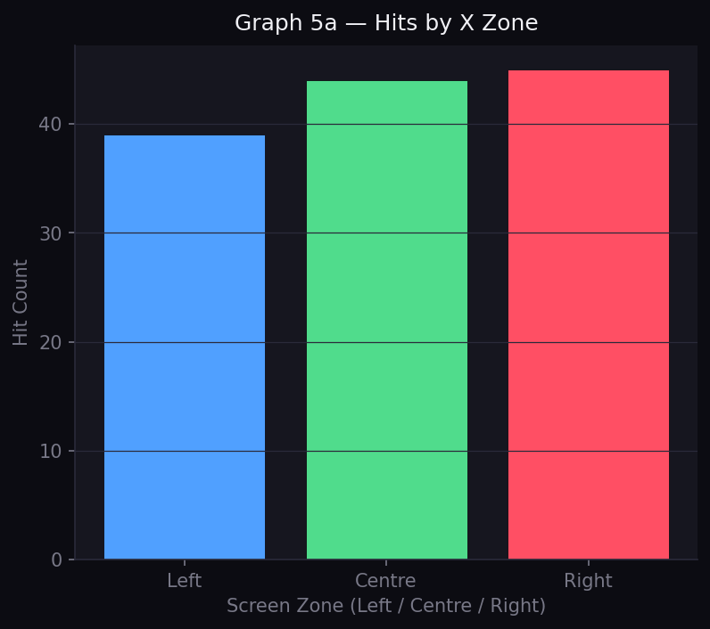
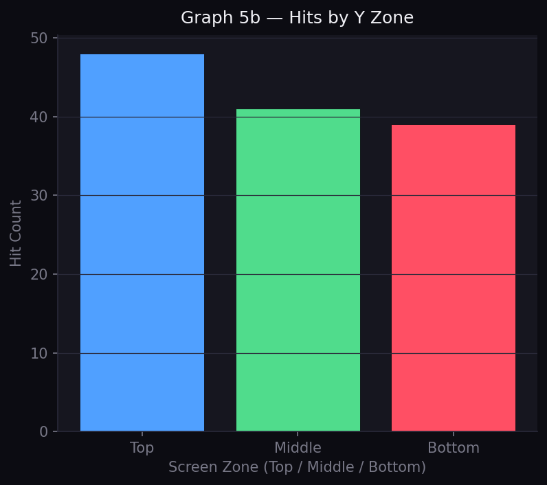
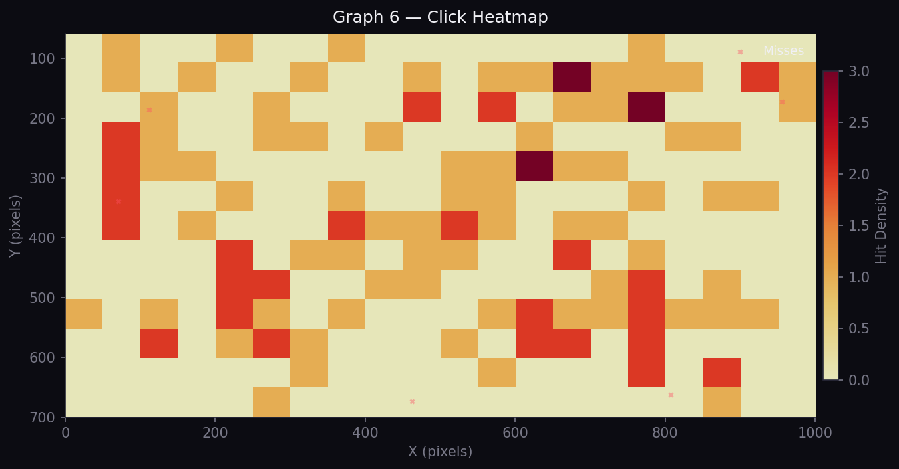
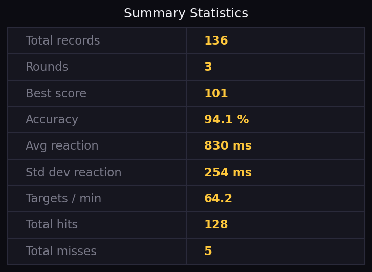
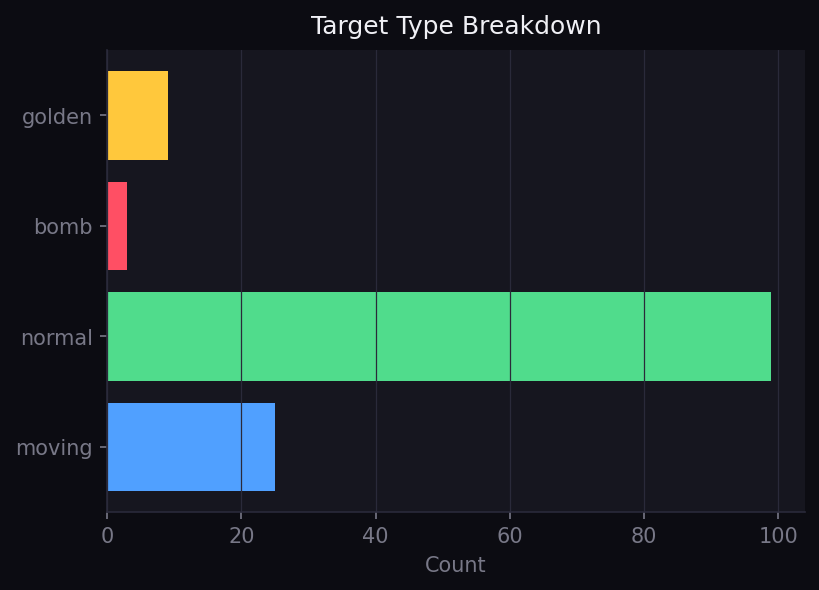

# PyAim — Data Visualization

This file documents every data visualization component in PyAim.
All graphs are generated using **matplotlib** from data recorded in `pyaim_data.csv`.
The analysis screen is accessed by clicking the **Analysis** button on the menu or results screen.

---

## Overview — Full Analysis Screen

The analysis screen displays all seven graphs and a summary panel in a single scrollable view inside the game window. The layout uses a 3-column grid on the left and a summary column on the right. Every graph is built in memory using `matplotlib` and rendered as a `pygame.Surface` — no external file is required for display. The screen rebuilds from the full CSV history each time it is opened, so it always reflects all sessions combined.

---

## Graph 1 — Reaction Time Histogram

**Type:** Histogram (Distribution)
**X-axis:** Reaction time in milliseconds
**Y-axis:** Frequency (number of clicks)

This graph shows the distribution of the player's reaction times across all recorded hit events. The golden dashed vertical line marks the mean reaction time, and a shaded band shows the ±1 standard deviation range. A narrow, left-skewed distribution indicates consistent fast reactions. A wide spread suggests the player's response time is inconsistent. Only clicks with `result = "hit"` are included; misses and bomb clicks have no reaction time and are excluded.

---

## Graph 2 — Score per Round

**Type:** Bar Chart (Comparison)
**X-axis:** Round number
**Y-axis:** Final score achieved in that round

Each bar represents the highest score recorded during one round. The most recent round is highlighted in green; all previous rounds are shown in blue. This graph lets the player compare performance across sessions at a glance and see whether their score is trending upward over time.

---

## Graph 3 — Hit vs Miss Ratio

**Type:** Pie Chart (Proportion)
**Segments:** Hit (green), Miss (red)

This chart shows the overall proportion of successful hits versus misses across all recorded data. The percentage label is displayed inside each segment. A high hit percentage indicates good accuracy. Bomb clicks are recorded separately as `result = "bomb"` and do not count toward either segment, so the chart reflects only intentional hit or miss decisions.

---

## Graph 4 — Score Progression

**Type:** Line Graph (Time-Series)
**X-axis:** Click number (sequential event index)
**Y-axis:** Running score at the time of each event

This graph shows how the player's score built up click by click throughout the entire recorded history. A steep slope indicates a high hit rate and active combo multiplier. A flat section shows a period of misses where the score stagnated. The shaded area under the line gives a visual impression of total accumulated score.

---

## Graph 5a — Hits by X Zone

**Type:** Bar Chart (Comparison)
**X-axis:** Screen zone — Left (0–333 px), Centre (333–667 px), Right (667–1000 px)
**Y-axis:** Number of hits recorded in that zone

This chart compares how many targets the player successfully hit in each horizontal third of the screen. A lower bar in one zone indicates the player struggles to click targets in that area, which may be due to mouse movement range or hand position. Only `result = "hit"` rows are counted.

---

## Graph 5b — Hits by Y Zone

**Type:** Bar Chart (Comparison)
**X-axis:** Screen zone — Top, Middle, Bottom (equal thirds of the play area below the HUD)
**Y-axis:** Number of hits recorded in that zone

This chart compares hit counts across the three vertical thirds of the play area. Combined with Graph 5a, it gives a complete spatial picture of where the player performs best and worst. If the Bottom zone consistently shows fewer hits, the player may need to adjust their arm or wrist movement for low-screen targets.

---

## Graph 6 — Click Heatmap

**Type:** 2D Histogram Heatmap (Spatial Distribution)
**X-axis:** Target spawn X coordinate (0–1000 px)
**Y-axis:** Target spawn Y coordinate (HUD height–700 px)
**Colour scale:** Yellow (low density) → Orange → Red (high density)

This is a 2D density map of all hit target positions across the entire play area. Warmer colours indicate zones where the player hit more targets. Miss positions are overlaid as small red × markers. The heatmap is built using `numpy.histogram2d` with a 20×13 bin grid. It is the most informative spatial graph, showing not just which zones are hit more but exactly where within those zones the player is accurate and where they struggle.

---

## Summary Statistics Panel

**Type:** Table

The summary panel appears to the right of the main graph grid. It shows the following derived statistics calculated from the raw CSV data at analysis time:

| Statistic | Description |
|---|---|
| Total records | Number of rows in the CSV file |
| Rounds | Number of distinct game sessions |
| Best score | Highest score achieved across all rounds |
| Accuracy | `(hits / total_clicks) × 100` |
| Avg reaction | Mean of all `reaction_time` values (hits only) |
| Std dev reaction | Standard deviation of reaction times |
| Targets / min | `total_hits / (time_span_seconds / 60)` |
| Total hits | Count of `result = "hit"` rows |
| Total misses | Count of `result = "miss"` rows |

---

## Target Type Breakdown

**Type:** Horizontal Bar Chart (Comparison)
**Y-axis:** Target type — normal, moving, golden, bomb
**X-axis:** Count of events for each type

This chart shows how many times each target type appeared in the recorded data. It helps confirm that the spawn probability settings are working as expected, and lets the player see how their hit/miss behaviour is distributed across different target types. Each bar is coloured to match the in-game target colour: green for normal, blue for moving, gold for golden, and red for bomb.
